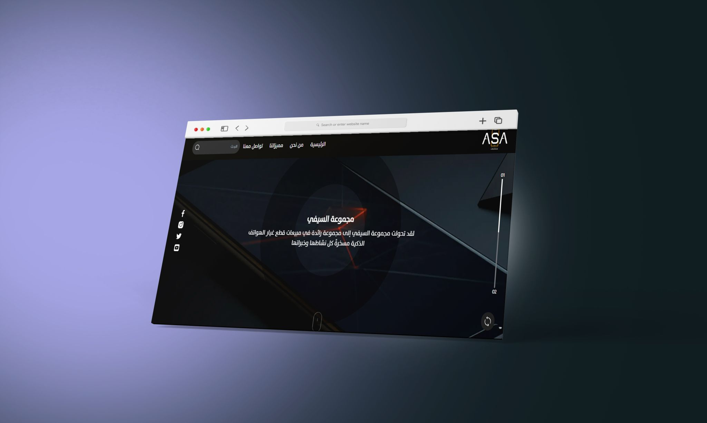
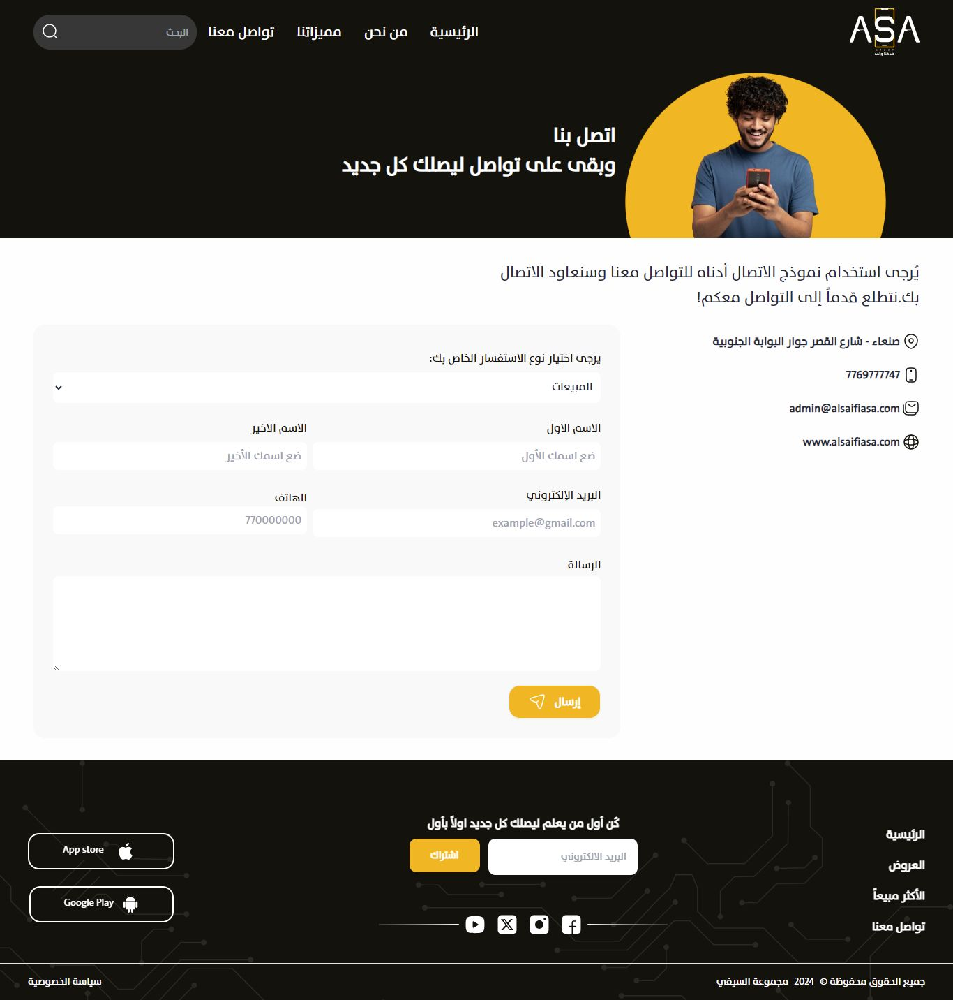
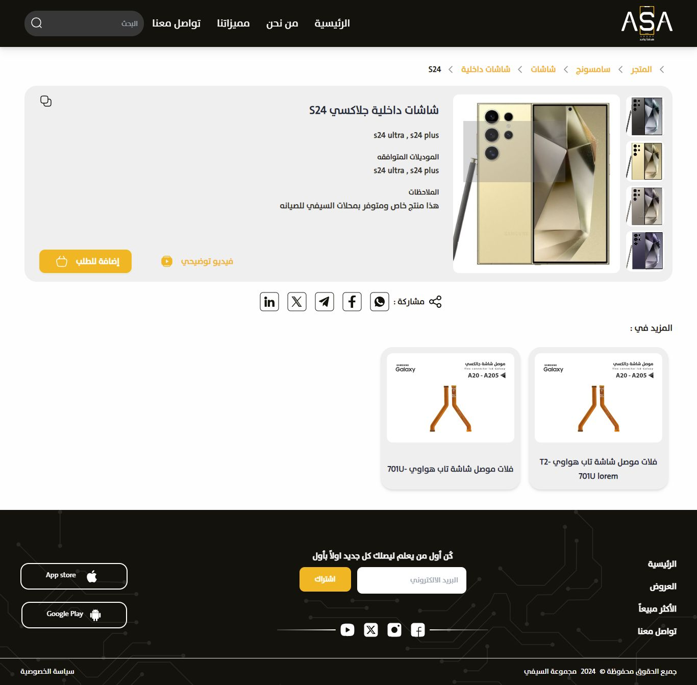

# ASA

Welcome to the ASA website project. This README will guide you through the details of the project, including a demo link, images, and descriptions of the key features.

## Demo

Check out the live demo of the website: [ASA Demo](https://mohdfahd.github.io/ASA/src/)

## Features

1. **User-Friendly Interface**: The ASA website features a clean and intuitive interface to ensure ease of use for all visitors.

2. **Responsive Design**: The site is fully responsive, ensuring a seamless experience on both desktop and mobile devices.

3. **Robust Functionality**: From search functionalities to dynamic content, the ASA website provides a robust and efficient user experience.

## Screenshots

Here are some screenshots of the ASA website:

### Home Page

_Description: The homepage of ASA showcasing the main features and navigation._

### Search Feature

_Description: The contact us page._

### Responsive Design

_Description: The details page._
